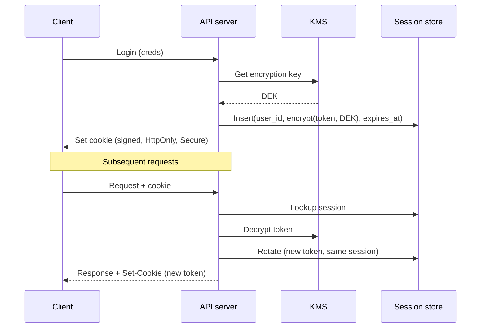

# Auth Rewrite Design

A worked example for testing deckify. Mixed density — has prose, bullets, code, mermaid, and a comparison.

## Why now

The current authentication middleware has accumulated three structural problems:

- Session tokens are stored in plaintext cookies. Legal flagged this in Q1 as a compliance gap against the updated data-handling requirements.
- Token rotation is missing entirely. We've had two incidents (INC-241 in February, INC-318 in April) where stolen tokens remained valid for weeks because there was no rotation cadence to invalidate them.
- The middleware code is undocumented and the only engineer who fully understood it left the company in March.

The compliance deadline is the forcing function. Legal needs us shipped by 2026-07-01.

## Goals

- Replace the middleware with a rotation-capable session system
- Encrypt tokens at rest
- Add structured audit logging for every session lifecycle event
- Keep the public API surface identical so client teams don't need to change anything

## Non-goals

- Switching auth providers (we stay on the current identity provider)
- Supporting JWTs (see "Considered alternatives" below)
- Rewriting the user model

## Considered alternatives

We considered JWTs and rejected them because the rotation story is fundamentally weak — once a JWT is issued, you can't revoke it without maintaining a denylist, which negates the stateless property that made JWTs attractive in the first place. The team's preference is to keep the session store and add rotation there.

We also considered a full migration to a managed auth service (Auth0, Clerk). Cost was the blocker — the price at our user volume would have been ~$180k/year, and we don't get a corresponding reduction in compliance burden because the audit-log requirements still apply to us as the data controller.

## Current vs proposed

| Aspect | Current | Proposed |
|---|---|---|
| Token storage | Plaintext cookies | AES-256 encrypted, key in KMS |
| Rotation | None | Every refresh + on suspicious activity |
| Audit log | Per-request | Per session-lifecycle event |
| Revocation | Manual DB row delete | Single API call |

## Current token handling

```go
func issue(ctx context.Context, userID string) (string, error) {
    tok := generateRandomBytes(32)
    if err := db.Exec(ctx, "INSERT INTO sessions (user_id, token, created_at) VALUES (?, ?, ?)",
        userID, tok, time.Now()); err != nil {
        return "", err
    }
    return base64.StdEncoding.EncodeToString(tok), nil
}
```

Note: no rotation, no expiry, token stored unencrypted.

## Proposed flow



## Implementation plan

1. **Week 1-2:** schema migration for the new session table (additive — keep the old table running).
2. **Week 3-4:** new middleware behind a feature flag, KMS integration, encrypted-write path.
3. **Week 5:** dual-write (old and new tables) to de-risk the cutover.
4. **Week 6:** flip the read path to the new table for 1% of traffic, then 10%, then 100%.
5. **Week 7:** drop the old table.

## Risks

- **KMS latency** adds ~5ms per request. We've measured this in staging; it's acceptable but worth flagging.
- **Migration backfill** for existing sessions: we'll force-rotate everyone over a 24h window. Users will see a single re-login. Comms team has been briefed.
- **Rollback plan:** the feature flag flips the read path back to the old table. The dual-write means no data is lost.

## Decision

Approved by the platform team on 2026-05-10. Implementation starts the week of 2026-05-26.
