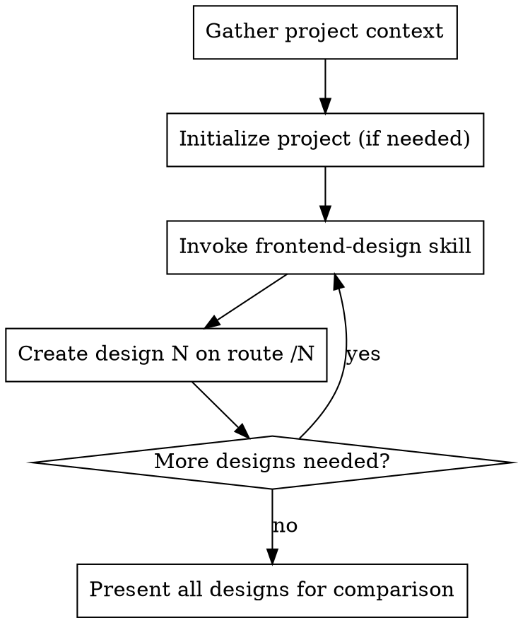

# Frontend Design Exploration

## Overview

Generate multiple distinct, creative frontend designs for a single concept. Each design takes a completely different creative direction, allowing you to compare approaches and pick your favorite.

## Workflow



## Parameters

Ask the user for these if not provided:

| Parameter | Default | Description |
|-----------|---------|-------------|
| Project description | (required) | What is the product/service? Who is it for? |
| Number of designs | 5 | How many variations to create |
| Tech stack | Vite + React + TypeScript + Tailwind + Bun | Project setup |
| Routes | /1, /2, /3... /N | Where each design is hosted |

## Execution

### 1. Gather Context

Ask the user (if not already provided):
- What is this site/product about?
- Who is the target audience?
- Any specific themes, colors, or vibes to explore?
- Any designs to avoid?

### 2. Initialize Project (if empty directory)

Default stack (adjust if user specifies different):
```bash
bun create vite . --template react-ts
bun add -d tailwindcss postcss autoprefixer
bunx tailwindcss init -p
bun install
```

Set up routing for multiple pages (React Router or file-based routing).

### 3. Create Each Design

For each design (1 through N):

1. **Invoke the frontend-design skill** - This is MANDATORY for each design
2. **Take a completely different creative direction** from previous designs:
   - Different layout structure
   - Different visual style/aesthetic
   - Different interaction patterns
   - Different typography approach
   - Different color palette
3. **Host on route /N** (e.g., /1, /2, /3, /4, /5)

### 4. Design Differentiation Ideas

Each design should explore a distinct direction:

| Design | Potential Direction |
|--------|---------------------|
| 1 | Minimal, clean, lots of whitespace |
| 2 | Bold, colorful, attention-grabbing |
| 3 | Playful, animated, interactive |
| 4 | Professional, corporate, trustworthy |
| 5 | Unique/experimental, push boundaries |

These are suggestions - be creative and surprise the user.

## Quality Standards

- Each design must be **production-grade**, not a rough mockup
- Each design must be **completely distinct** from the others
- Use the **frontend-design skill** for EVERY design to ensure high quality
- Designs should be **fully responsive**
- All designs should be **functional** (not just visual)

## Common Mistakes

| Mistake | Fix |
|---------|-----|
| Designs too similar | Force yourself to change layout, colors, AND style for each |
| Skipping frontend-design skill | ALWAYS invoke it - it ensures quality |
| Rushing later designs | Design 5 should be as polished as design 1 |
| Generic AI aesthetics | Push for distinctive, memorable designs |
