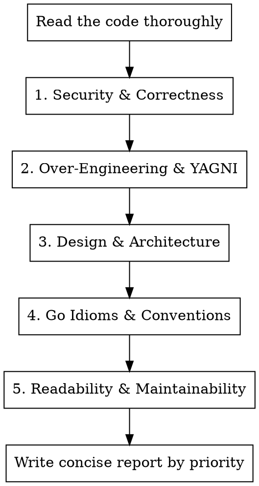

# Go Code Review

## Overview

Structured review of Go code for quality issues. Prioritize findings by severity: security/correctness first, then design/architecture, then idioms/style. Be concise — flag the issue, explain why it matters, and move on.

## Review Process



## Review Checklist

### 1. Security & Correctness (Critical)

**SQL injection / command injection:** Any string interpolation into queries or shell commands is a critical finding. Always use parameterized queries.

**Race conditions:** Look for check-then-act patterns with mutexes, shared state accessed without synchronization, and pointer aliasing through caches (returning cached pointers lets callers mutate shared state).

**Error handling:**
- Ignored errors (especially `_ = something()` patterns)
- `err == sentinel` instead of `errors.Is(err, sentinel)` — breaks with wrapped errors
- Inconsistent wrapping — either always wrap with context or have a clear strategy
- Panics in library code (panics should almost never exist outside `main`)

**Resource leaks:** Unclosed HTTP response bodies, file handles, DB rows, channels.

**Nil dereferences:** Methods called on potentially nil receivers, unchecked type assertions.

### 2. Over-Engineering & YAGNI (High Priority)

This is the most common problem in Go code. Go's power comes from simplicity — fight complexity.

**Premature interfaces:** The #1 Go over-engineering anti-pattern. Red flags:
- Interface defined in the same package as its only implementation
- Interface with only one implementation
- `type FooInterface interface` / `type FooImpl struct` naming (Java-ism)
- Constructor returning an interface type instead of concrete type

**Go rule:** Accept interfaces, return concrete types. Interfaces belong at the *consumer* site, not the *producer* site. If there's one implementation, you don't need an interface yet.

**Unnecessary abstraction layers:** Helper functions called once, wrapper types that add no value, "manager" or "service" structs that just proxy to another dependency.

**Premature caching/optimization:** In-memory caches without eviction, TTL, or size bounds. Question whether the cache is needed at all — is there measured performance data justifying it?

**Unused or dead code:** Unexported fields never read or written, TODO functions that panic, commented-out code. The fix is *delete it*, not "implement it later."

**Feature creep in types:** Fields in structs that are never populated or used (like an unexported `metadata map[string]interface{}` that nothing touches).

### 3. Design & Architecture

**Package boundaries:** Is the code in the right package? Is there circular dependency risk? Are internal details leaking through exports?

**Dependency injection:** Hardcoded dependencies (e.g., `log.Default()`) that should be injected for testability. Check that constructors accept all meaningful dependencies.

**Consistency:** Cache updated on read but not write? Error wrapped in one method but bare in another? These signal code that grew organically without a design.

**Concurrency model:** `sync.Mutex` where `sync.RWMutex` is appropriate (read-heavy workloads). Locks held across I/O operations (DB calls, network). Consider whether `sync.Map` or `singleflight` would be more appropriate.

### 4. Go Idioms & Conventions

**Naming:**
- Interfaces: name by behavior, not `FooInterface`. Single-method interfaces use `-er` suffix (`Reader`, `Stringer`).
- Implementations: descriptive names (`postgresStore`, `cachedClient`), never `FooImpl`.
- Receivers: short, consistent (1-2 letters), never `self` or `this`.
- Unexported when possible — minimize exported surface area.

**Modern Go:**
- `interface{}` → `any` (Go 1.18+)
- Use `errors.Is` / `errors.As` instead of `==` comparison (Go 1.13+)
- Use `slog` for structured logging (Go 1.21+)
- Use generics where they reduce genuine duplication (Go 1.18+), but don't force them

**Error patterns:**
- Wrap errors with `fmt.Errorf("context: %w", err)` at package boundaries
- Define sentinel errors or error types for cases callers need to handle
- Never panic in library code

**Constructor patterns:**
- `NewFoo()` returns `*Foo`, not an interface
- Use functional options (`WithLogger(l)`, `WithTimeout(d)`) for optional configuration instead of config structs with many zero-value fields

### 5. Readability & Maintainability

**Code organization:** Functions should be short and focused. If a function does multiple unrelated things, split it. But don't split into trivial one-line helpers — that's over-engineering.

**Comments:** Comments should explain *why*, not *what*. `// GetUser retrieves a user by ID` on `func GetUser` is noise. Comments restating the code are worse than no comments.

**Logging PII:** Watch for logging of email addresses, passwords, tokens, or other sensitive data. Flag as a compliance risk.

**Magic values:** Unexplained numeric constants, string literals used as keys, hardcoded URLs or paths.

**Test considerations:** Is this code testable? Can dependencies be swapped? Are there global state dependencies that make testing hard?

## Report Format

Structure your review output like this:

```
## Critical
- **[Issue]**: [1-2 sentence explanation with specific line/function reference]

## High
- **[Issue]**: [1-2 sentence explanation]

## Medium
- **[Issue]**: [1-2 sentence explanation]

## Low
- **[Issue]**: [1-2 sentence explanation]
```

**Rules for the report:**
- Lead with the most severe issues
- Be specific — reference function names, line numbers, variable names
- Explain *why* it's a problem, not just *what* the problem is
- Keep each finding to 1-3 sentences. If you need more, the finding should be split.
- Don't pad with praise. Skip "good job on X" — focus on what needs fixing.
- Group related issues (e.g., "SQL injection in GetUser, CreateUser, and DeleteUser" not three separate findings)
- If you see no issues at a severity level, skip that section entirely

## Common Mistakes in Reviews

**Being too verbose:** A review with 20 paragraphs won't be read. Be surgical.

**Suggesting over-engineering as a fix:** Don't suggest adding interfaces, abstractions, or patterns unless there's a concrete need. "You should add an interface for testability" is only valid if the code is actually hard to test without one.

**Nitpicking style in the presence of bugs:** If there's a SQL injection, don't spend equal time on naming conventions. Prioritize.

**Suggesting `sync.RWMutex` reflexively:** Only suggest it if reads genuinely dominate and the critical section is meaningful. For trivial operations the performance difference doesn't matter.
